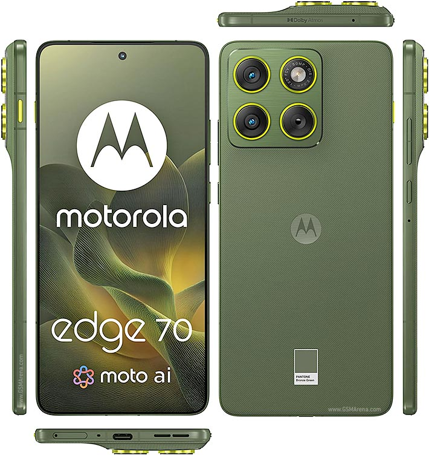

# Unified Device Tree for Motorola Edge 70 Fusion (`marvel` / `avenger`)

<p align="center">
  
</p>

This repository provides the unified AOSP / LineageOS / Evolution X device tree configuration for the **Motorola Edge 70 Fusion** (Codename: `marvel` / `avenger`, Model: `XT2605` series).

---

## 📱 Device Specifications

| Feature | Specification |
| :--- | :--- |
| **SoC** | Qualcomm Snapdragon 7s Gen 3 / Gen 4 (`SM7750` / `sm7635`) |
| **CPU** | Octa-core Kryo architecture |
| **GPU** | Qualcomm Adreno GPU |
| **Display** | 6.78-inch 1.5K Extreme AMOLED, 144Hz, Quad-Curved |
| **Battery** | 7,000 mAh Silicon-Carbon, 68W TurboPower |
| **Cameras** | 50 MP (Sony Lytia 710, OIS) + 13 MP (Ultra-Wide/Macro) + 32 MP Front |
| **Storage / RAM** | 8GB/12GB LPDDR5X + 128GB/256GB/512GB UFS |
| **Biometrics** | Optical In-Display Fingerprint Sensor |
| **Android Version** | Android 16 (GKI 6.6, Header v4) |

---

## 📂 Repository Structure

```
device/motorola/avenger/
├── Android.bp                       # Blueprint targets & namespaces
├── Android.mk                       # Legacy makefile hook
├── AndroidProducts.mk               # Target definitions (lineage_avenger / orangefox_marvel)
├── BoardConfig.mk                   # Dynamic partition limits, GKI 6.6, AVB, sepolicy
├── device.mk                        # Hardware permissions, copy files, system props
├── lineage_avenger.mk               # LineageOS product configuration
├── extract-files.sh                 # Vendor blob extraction script
├── proprietary-files.txt            # Manifest of proprietary binaries
├── prebuilt/                        # Authentic Qualcomm SM7750 DTB & DTBO
├── configs/                         # Audio, GPS, Wi-Fi, Keylayout configs
├── rootdir/                         # fstab.qcom (FBE v2) and device init scripts
├── rro_overlays/                    # Runtime resource overlays (144Hz, 1.5K display)
└── sepolicy/                        # SELinux vendor context rules & HAL permissions
```

---

## 🚀 How to Build Custom ROM (Android 16)

### 1. Extract Vendor Blobs
```bash
./extract-files.sh /path/to/extracted/firmware
```

### 2. Build the ROM
```bash
source build/envsetup.sh
lunch lineage_avenger-userdebug
m bacon -j$(nproc --all)
```

---

**Maintainer:** Shripad (@shripad-jyothinath)
